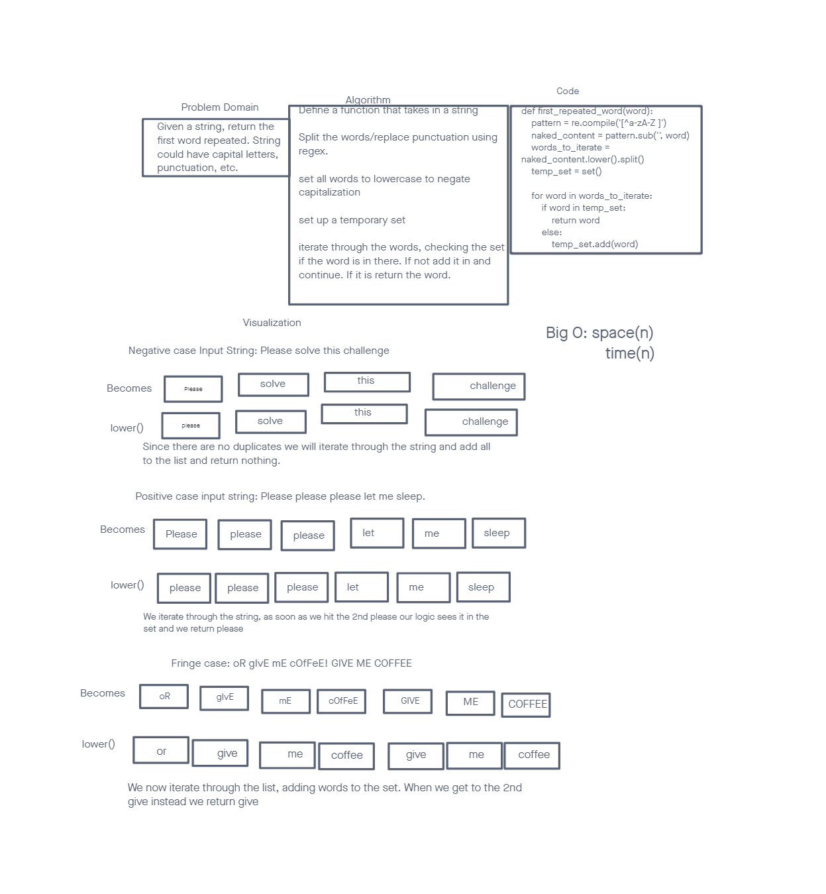

# Hashtable Repeated Word

## Challenge

Given a string, check for repeated words and return the first that is repeated.

## Whiteboard

## Approach & Efficiency

Since we are building a set that could be as long as the string has words we have a space of O(n). We also have to iterate through that list and check the set each time so time would be O(n) as well.

