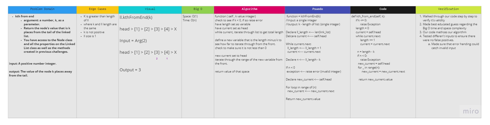

# Kth from the end

Take in a linked list and an integer. Then return the value that is that integer places from the end of the linked list.

## Whiteboard Process

## Approach and Efficiency

To iterate through the linked list to find out how long it is. Then check to make sure the linked list is long enough to have a value k places away from the end. If it is then iterate back through using a range going to the length of the list minus k. Return that value.