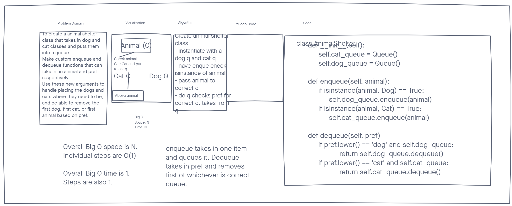

# Challenge Summary

This challenge is to make an animal shelter class that can take in Dog and Cat classes, and enter them into a queue. Then when someone wants to take one out, they give a preference. The first animal in the queue that matches their preference is removed, and nothing else about the queue changes.

## Whiteboard Process

## Approach and Efficiency

I decided it would be easier and less steps to just make two queues. That way I don't have to fully unpack the queue every time someone wants to take an animal out. Just check their pref, grab from the correct queue. I decided to also do the stretch goal. In this case I have a variable that is an empty list, append to it every time I enqueue an animal with a string of whatever it was. Then when someone is dequeing, I check their pref and `remove()` from the list their pref while dequeing that animal. If pref is input as none, or left blank it defaults to none, then it pops the first index in the list off and sets pref to that value, then continues with the dog or cat logic.

Big O of both should be 1 since they are a dictated amount of steps. The animal shelter in general can be Space: O(n) since it can take in n amount of animals. Animal shelter would still be time of 1 though since it doesn't have to iterate through any of the lists of any type.
