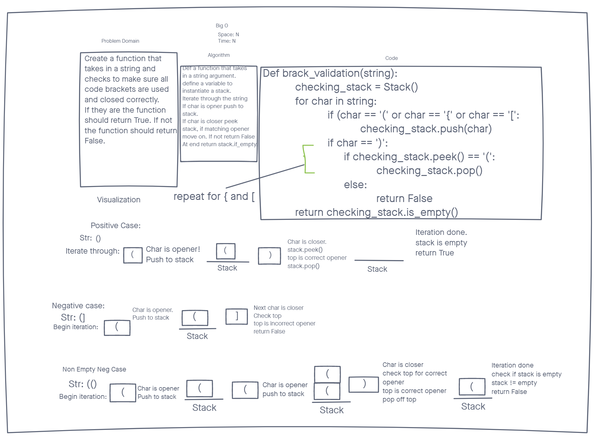

# Challange Summary

To define a function that can take in a string, will iterate through the string, and make sure all code brackets match up correctly.

## Whiteboard Process

## Approach and Efficiency

The approach I took ended up a bit different than the whiteboard example. I forgot to take into account that the peek method on our stacks would return an error if called on an empty list. Other than that I freely push openers into the stack, then if I come across a closer I check to see if the corresponding opener is the top, if not I return false. If it DOES match then I pop that opener off and move on. At the end I check to make sure the stack is empty. If it isn't false is returned, true if it is.

Big O:
For space and time it is both n. If I just had to iterate through the string it would be space of 1, but since I am making a stack that could be as long as the string it is n. For time I am iterating through a string so that is n. I do the checking as I go and then just validate the stack is empty at the end so no more time is added and stays n.