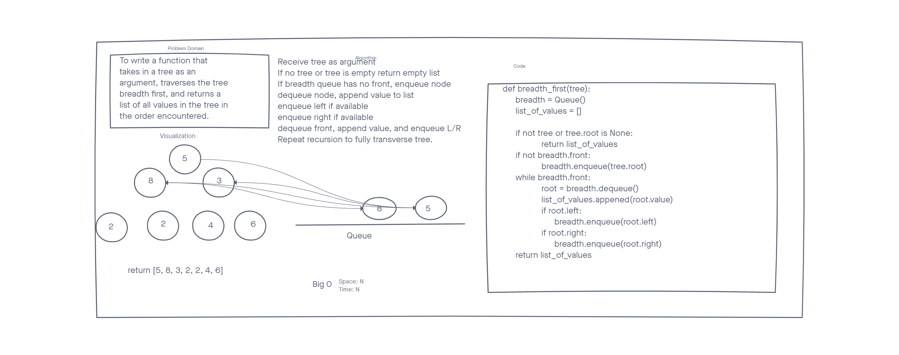

# Tree Breadth First

Given a tree as an argument, return a list of it's values breadth first.

## Whiteboard Process

## Approach and Efficiency

Since we talked in class about using a queue due to the values of all the nodes being nodes I continued on that approach.

The big O for space and time are both N. This is because we build a queue and enqueque/dequeue every node and do so by traversing every node in the tree.