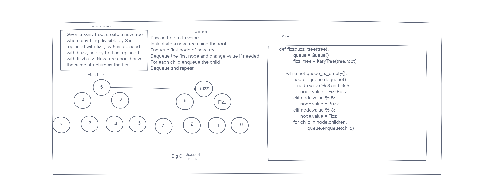

# Tree Fizz Buzz

Given a tree as an argument, create a new tree with the same layout where every value follows the rules of fizzbuzz.

## Whiteboard Process

## Approach and Efficiency

I honestly am not sure if this works. I think because the root has references to the children it should stay in order. Nor am I really sure if this is making a new tree or just replacing the one originally referenced.

Either way the space and time is n. Since we have to traverse the tree completely and make an entirely new tree of the same size.