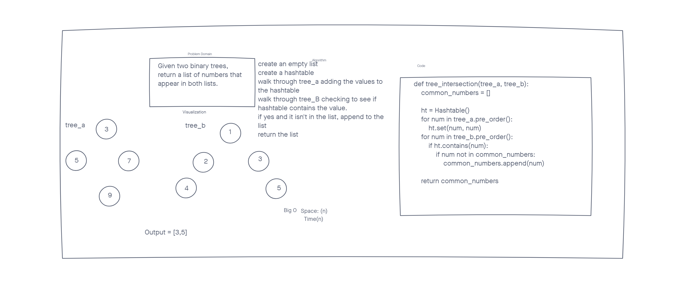

# Tree Intersection

## Challenge

Given two binary trees, return a list of values that are shared between the two trees.

## Whiteboard

## Approach & Efficiency

Space would be O(n) since we are building a hashtable and a list that could both be n long and 2n simplifies to n.
Time would be O(n) since we are traversing two trees and 2n simplifies to n
