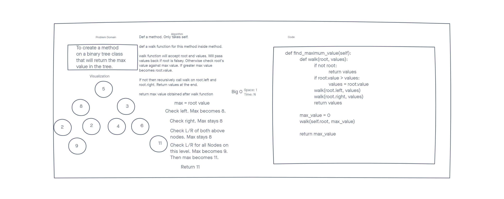

# Tree Max

Define a method on a tree class that will search through the tree and return the highest value in the tree. Assume only integers in the tree.

## Whiteboard Process

## Approach & Efficiency

During lecture we were told the ideal was to write a function where everything is passed into it. That is not to create a variable on the Binary Tree class and alterate it. I define a holder function in my method, then pass it into the walk function inside of it. The walk function will compare the value on the root, if it is greater the max will be set to that. Then it will recursively call itself on the root left and root right.

The Big O of Space for this method is 1. It creates the holder variable and that is it. The tree is already in place and it just runs on it.

The Big O of time is n since it has to check every node in the tree.