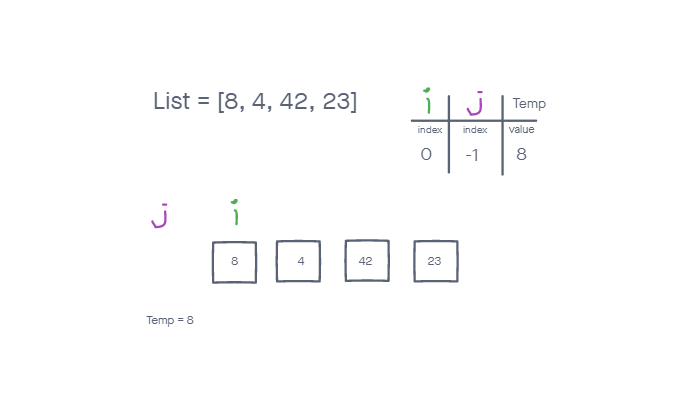
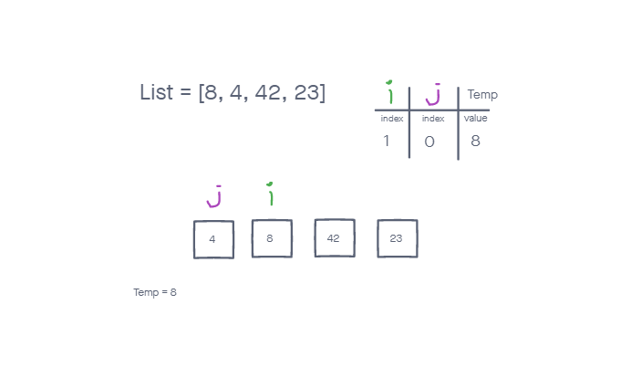
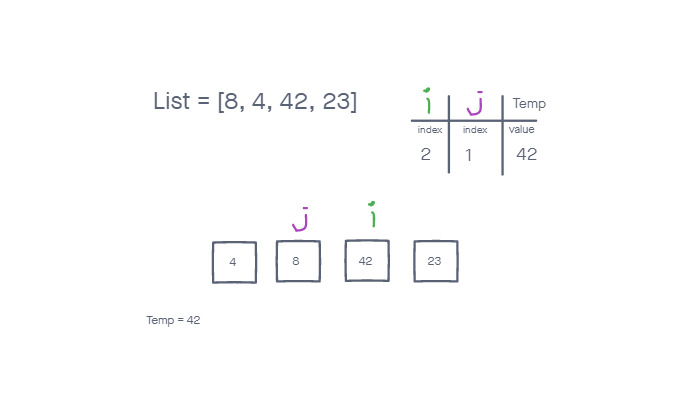
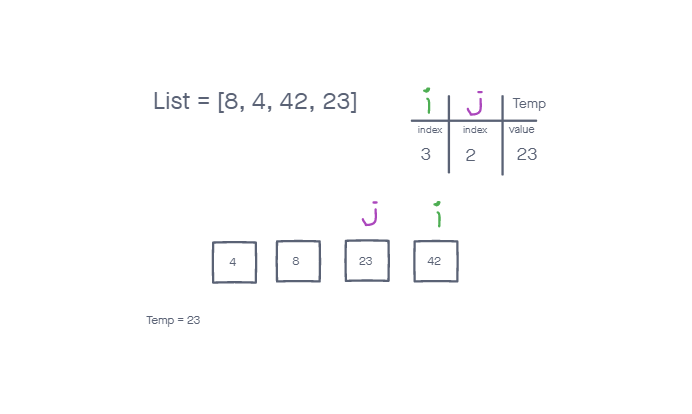

# Blog Notes: Insertion Sort

Hello! Today we will be going over how to do an Insertion Sort on a list (or array in some languages). When walking through it on your own it is easy to visualize what is happening and for our minds to do it. For computers who really need to be told exactly what to do it is a bit harder. Lets take a look.
<br/>
<br/>

## Step by Step Process

* Look at the list one element at a time.
* Keep track of the previous element and keep current value in a temp variable.
* Check to see if any of the previous elements are higher than the current index variable. If so switch.
* After checking back through all previous elements, continue incrementing forward.
* Repeat until the end of the list.
<br/>
<br/>

## How it looks in practice
<br/>
<br/>

We start by taking in the input list. At our initialization nothing much is happening. Our i is at the first index, temp is set to that index value and is being compared to nothing. Soon that will change!

  
<br/>
<br/>
  
In our second step our j is now involved and we are already making changes! 4 is lower than 8 so the values will be traded. Temp is then set to index 1's value which is now 8 so it looks unchanged.


<br/>
<br/>  
  
In our third step, i is now at index 2, and j at 1. Since 8 is lower than 42 nothing is changed. Temp becomes 42.

 
<br/>
<br/> 
  
In step 3 we find a 23 at the end which is lower than the 42 we have in index 2. The values are swapped and temp becomes 23.

 

<br/> 
  
At this point our i has hit the end of the range and our code is finished! Take a look, the list should be ordered lowest value to highest value now!
<br/>
<br/>
<br/>

## The Code

```
def insertion_sort(list):

    for i in range(len(list)):
        j = i - 1
        temp = list[i]

        while j >= 0 and temp < list[j]:
            list[j+1] = list[j]
            j -= 1

        list[j+1] = temp

    return list
```
<br/>
<br/>

## The Big O

So for this approach our Big O of space will be 1. We take in an existing list and modify it in place. The only thing we are creating is one temp variable. However the time would be O(n^2). This is because every step in the for loop, we are iterating through the list.
